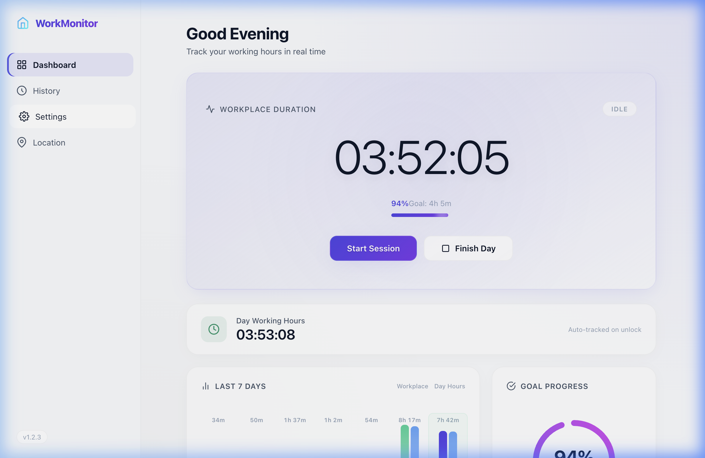
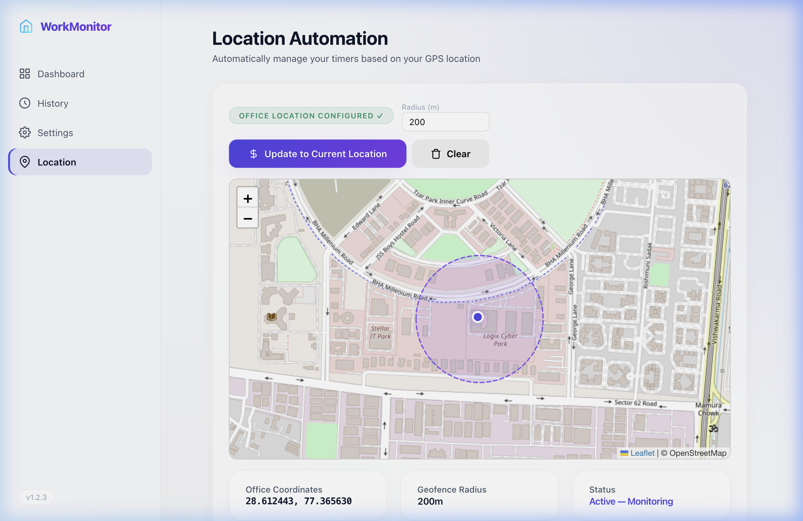
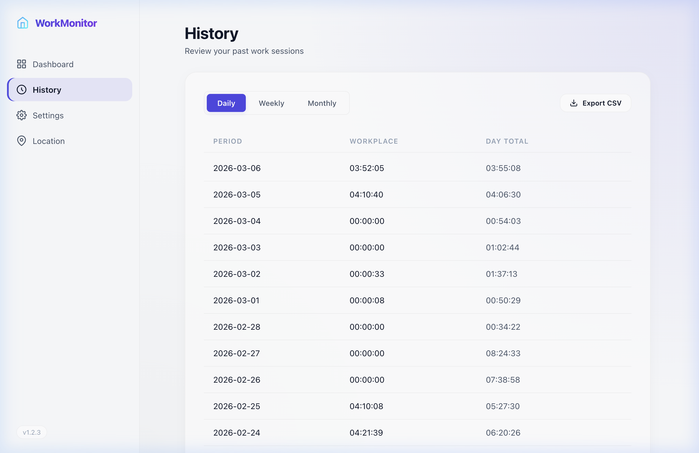
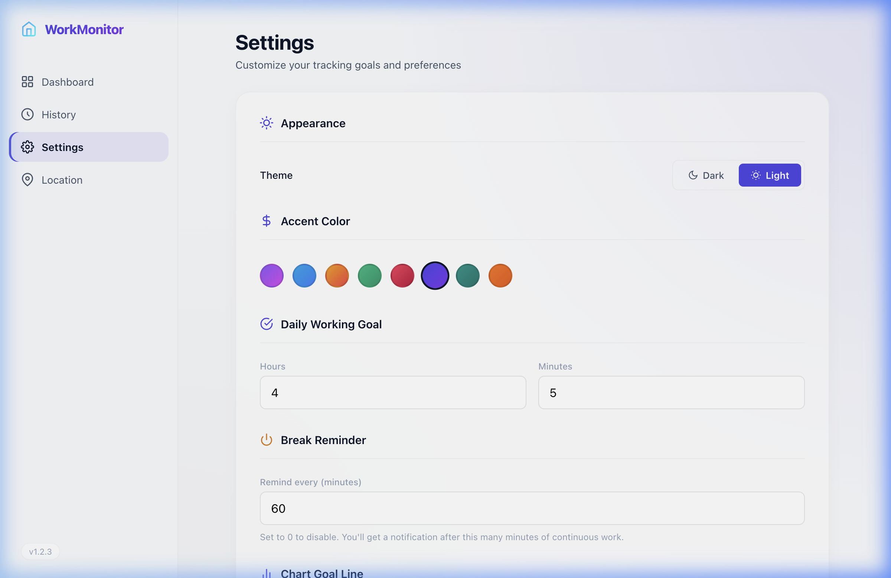

# WorkMonitor — Working Hours Tracker

A professional, secure, and automated time tracking application for macOS with a native dashboard, app usage analytics, GPS-based location automation, and smart sleep detection.

## Screenshots

| Dashboard | Location Automation |
|:---------:|:-------------------:|
|  |  |

| History | Settings |
|:-------:|:--------:|
|  |  |

## Key Features

### Dual-Mode Time Tracking
- **Workplace Duration** — Manual start/stop/pause for focused work sessions with a configurable daily goal.
- **Day Working Hours** — Automatic tracking that starts on screen unlock and pauses on lock/sleep. Sleep-aware: time is never counted while the Mac is asleep.

### 🆕 Location-Based Automation (GPS)
- **Automatic Timer Switching** — Automatically starts the Workplace timer when you arrive at the office and finishes it when you leave.
- **Interactive Map View** — Dedicated Location page with a Leaflet-powered map showing your office geofence circle and current position.
- **Configurable Geofence** — Set your office coordinates with a single click and adjust the radius (50–2000m).
- **CoreLocation Integration** — Uses native macOS `CLLocationManager` for efficient background location tracking.
- **Stale Session Recovery** — Server automatically completes orphaned sessions on startup if they've been idle for 30+ minutes.

### Native macOS App
- **Menu Bar Widget** — Real-time timer displayed in the macOS menu bar.
- **Built-in Dashboard** — Native WKWebView window (no browser required). Opens via "Open Dashboard" in the menu bar.
- **Screen Lock/Unlock Detection** — Listens to `com.apple.screenIsLocked` / `com.apple.screenIsUnlocked` distributed notifications.
- **Sleep/Wake Detection** — Listens to `NSWorkspace.willSleepNotification` / `didWakeNotification` to pause tracking during system sleep.

### App Usage Tracking
- Automatically tracks the **frontmost application** every 5 seconds.
- Shows a ranked horizontal bar chart of today's top 10 apps by usage time on the dashboard.
- Pauses tracking when the screen is locked or the system is asleep.

### Dashboard & Visualizations
- **Weekly Bar Chart** — Last 7 days of Workplace Duration with dynamic color coding:
  - Purple = below goal
  - Green = goal met
  - Orange/Amber = overtime (goal + 1 hour)
- **Goal Progress Ring** — Circular progress indicator with the same dynamic color tiers.
- **Today's Activity Timeline** — Chronological list of lock/unlock events.
- **App Usage Chart** — Horizontal bars showing per-app time for today.
- **Auto-Refresh** — Dashboard data refreshes automatically when the window regains focus.

### Work History
- **Daily, Weekly, Monthly** reports showing both Workplace Duration and Day Working Hours.
- **CSV Export** — Download any report period as a CSV file.
- Data stored locally in SQLite — never leaves your machine.

### Configurable Goal
- Set a custom daily working goal (default: 4 hours 10 minutes) from the Settings view.
- Goal is used for the progress bar, ring, and bar chart color thresholds.

## Installation

### DMG Installer (Recommended)
1. Download or build `WorkingHours.dmg`.
2. Double-click to open, then drag `WorkingHours.app` to the Applications folder.
3. Launch from Applications. The app starts automatically on login.

### PKG Installer
1. Locate `WorkingHours.pkg` in the project root.
2. Double-click to install.
3. The app installs to `/Applications/WorkingHours.app` and starts automatically on login.

### Manual Start (Development)
1. Ensure Node.js is installed.
2. Install dependencies:
   ```bash
   npm install
   ```
3. Run the start script:
   ```bash
   ./start.sh
   ```
4. Access the dashboard at `http://127.0.0.1:3000`.

> **Note:** `start.sh` automatically builds a local `.app` bundle so macOS grants Location permissions during development.

### Build from Source
```bash
./build_app.sh    # Builds WorkingHours.app and WorkingHours.zip
./build_pkg.sh    # Builds WorkingHours.pkg installer
./build_dmg.sh    # Builds WorkingHours.dmg drag-and-drop installer
```

## Location Automation Setup

1. Open the Dashboard and navigate to the **Location** tab.
2. Click **Set Current Location as Office** — this uses your browser's GPS to capture your office coordinates.
3. Adjust the **Radius** if needed (default: 200m).
4. Grant Location permission when macOS prompts.
5. The system will now automatically:
   - **Start** the Workplace timer when you enter the geofence.
   - **Finish** the Workplace timer when you leave the geofence.

## Uninstallation

```bash
./uninstall.sh
```
This removes the application and all background LaunchAgents.

## Project Structure

```
├── mac_utility.swift    # Native macOS app: menu bar, WKWebView dashboard,
│                        #   lock/unlock/sleep detection, CoreLocation, app usage
├── server.js            # Express backend: session management, location geofencing,
│                        #   reports, background timer loop
├── db.js                # SQLite schema, migrations, and query functions
├── public/
│   ├── index.html       # Dashboard HTML with charts, controls, and map view
│   ├── style.css        # Dark/Light theme UI with modern glass-card design
│   └── app.js           # Frontend logic: timer, charts, Leaflet map, auto-refresh
├── screenshots/         # README screenshots
├── build_app.sh         # Compile Swift + bundle into .app
├── build_pkg.sh         # Compile Swift + create .pkg installer
├── build_dmg.sh         # Create drag-and-drop DMG installer
├── launcher.sh          # Entry point for .app bundle
├── start.sh             # Dev start script (builds local .app for Location access)
├── uninstall.sh         # Clean removal script
├── Info.plist           # macOS app bundle configuration (includes Location keys)
└── package.json         # Node.js dependencies
```

## Tech Stack

- **Frontend** — Vanilla HTML/CSS/JS, SVG icons, Leaflet.js (maps), CSS grid/flexbox
- **Backend** — Node.js, Express, better-sqlite3
- **Native** — Swift, AppKit, WebKit (WKWebView), CoreLocation
- **Database** — SQLite (stored in `~/Library/Application Support/WorkingHours/`)

## Security

This application is designed with privacy in mind:
- Binds strictly to `127.0.0.1` — data never leaves your machine.
- No external network requests or telemetry (map tiles loaded from OpenStreetMap CDN).
- Database stored locally in Application Support.
- Location data is only sent to the local server, never to any external service.
