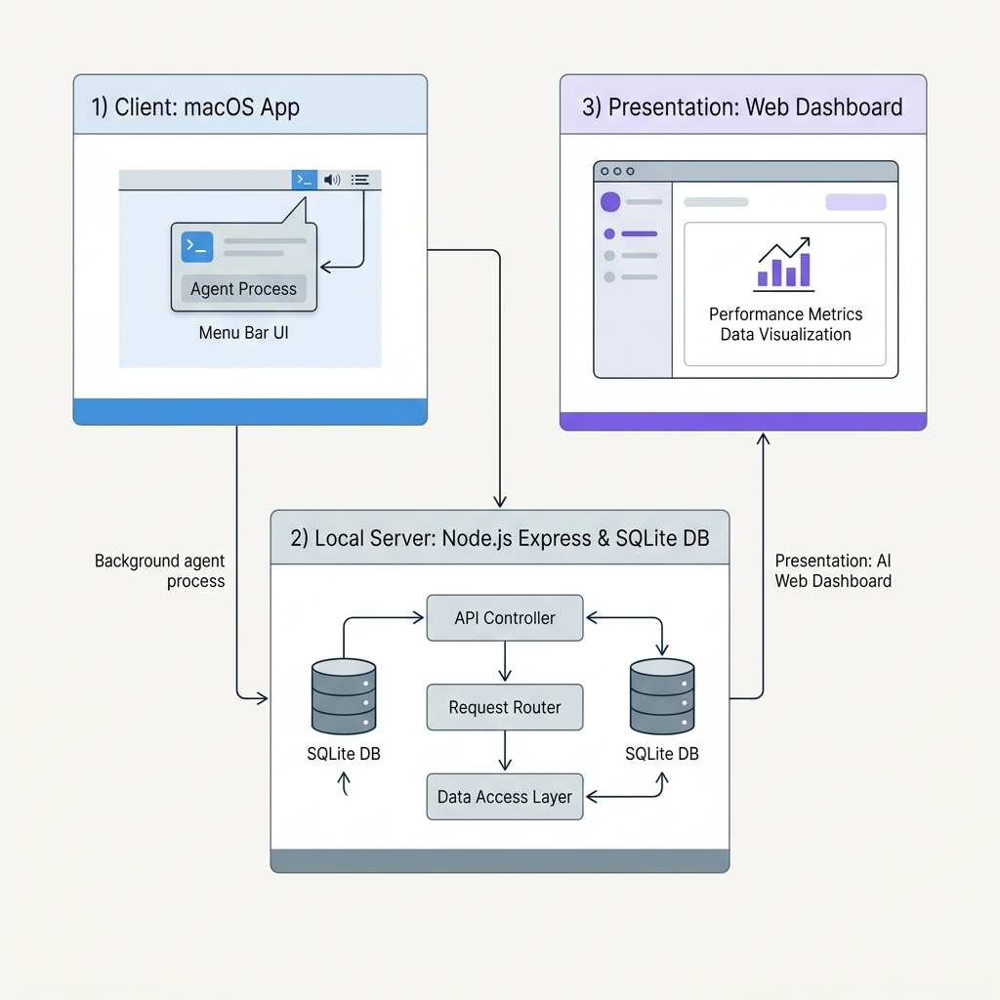

# System Architecture & Development Guide

This document details the software architecture, database schema, and guidelines for future development on the **Workplace Monitor** application.



---

## 1. Project Components

The system is built as a hybrid desktop utility combining a lightweight macOS Swift wrapper with a local Node.js Express backend and a glassmorphic frontend single-page application (SPA).

```
┌────────────────────────────────────────────────────────┐
│                   macOS Swift App                      │
│   (mac_utility.swift / monitor.swift)                  │
└───────────▲───────────────────────────────│────────────┘
            │ Event Alerts                  │ Status / Control API
            │ (e.g., Break Reminders)       ▼ (Port 3000)
┌───────────│────────────────────────────────────────────┐
│                  Node.js Backend                       │
│    (server.js, db.js, controllers/, routes/)           │
└───────────────────────────────────────────▲────────────┘
                                            │ Local Static Assets
                                            ▼ / API Fetch
┌────────────────────────────────────────────────────────┐
│                 Frontend HTML5 SPA                     │
│    (public/index.html, public/app.js, public/style.css)│
└────────────────────────────────────────────────────────┘
```

### 1.1 macOS Swift wrapper (`mac_utility.swift` / `monitor.swift`)
* Runs in the background and tracks system sleep, screen lock, and active window events via macOS APIs (`NSWorkspace.shared.notificationCenter` and AppleScript).
* Communicates lock/unlock events to the Node.js server via HTTP POST requests (e.g. `/lock-event`, `/wake-event`).
* Spawns a floating utility window to display break popups. Receives window closed/dismiss events and forwards them to the server to handle snooze/dismiss logic.

### 1.2 Node.js Backend (`server.js` / `db.js`)
* Runs an Express.js server (typically on port 3000).
* Manages core business logic, session duration calculation, dynamic break scheduling algorithms, and database operations.
* Segmented into modular routes:
  - `routes/settings.js`: Handles user settings persistence.
  - `routes/projects.js`: Manages project metrics and logs.

### 1.3 Frontend SPA (`public/`)
* **`index.html`**: Fully responsive dashboard wrapper styled using custom vanilla CSS.
* **`app.js`**: Core frontend script managing view switching, theme toggles, Chart.js rendering, status badge polling, and settings forms.
* **`style.css`**: Global design token variables (margins, colors, glassmorphic blur filters, custom row grid sizing utilities, and interactive states).

---

## 2. SQLite Database Schema
The database is located in the user's application directory (e.g. `~/Library/Application Support/WorkingHours/working_hours.db`). It runs in **WAL (Write-Ahead Logging)** mode to permit safe concurrent queries.

### 2.1 Table: `sessions`
Tracks active work sessions.
* `id` (INTEGER, Primary Key)
* `date` (TEXT, e.g., `YYYY-MM-DD` local time)
* `start_time` (TEXT, ISO-8601 local timestamp)
* `end_time` (TEXT, ISO-8601 local timestamp or NULL)
* `last_tick` (TEXT, ISO-8601 local timestamp of last active heartbeat)
* `location` (TEXT, 'WFO' / 'WFH')
* `snooze_until` (TEXT, ISO-8601 timestamp for scheduling sidetracked break popups)

### 2.2 Table: `app_usage`
Aggregated active time spent per application per day.
* `date` (TEXT, YYYY-MM-DD)
* `app_name` (TEXT)
* `total_seconds` (INTEGER)

### 2.3 Table: `app_usage_timeline`
Fine-grained timeline logging of application usage.
* `timestamp` (TEXT, ISO-8601 timestamp of log entry)
* `date` (TEXT, YYYY-MM-DD)
* `app_name` (TEXT)
* `duration_seconds` (INTEGER)

### 2.4 Table: `settings`
Persistent user configuration key-value storage.
* `key` (TEXT, Unique Index)
* `value` (TEXT)

---

## 3. Development & Extension Guidelines

When continuing development or introducing an AI agent to the codebase, adhere to these practices:

### 3.1 SQLite Sandbox Bypassing
* **Issue:** Because the database file resides in the user's `Library/Application Support` folder, standard sandbox terminal environments block write access, resulting in `SqliteError: attempt to write a readonly database`.
* **Fix:** Always execute node server operations (`node server.js`) with `BypassSandbox: true` to grant write permissions to the database.

### 3.2 Main loop Sync Checks
* **Issue:** Automatic dashboard refreshes can override the DOM state of editing fields or customizable views (such as the reordering list on settings).
* **Rule:** Always guard refreshes in `public/app.js` using flags (e.g. checking if the settings tab is active, or if `isLayoutDirty` is true) to suspend polling.

### 3.3 Dynamic Sizing Layout Templates
* **Issue:** Adding new widgets or altering sizes can break the dashboard grid layout.
* **Rule:** If you add cards, register their width requirements in the `CARD_WIDTH_REQUIREMENTS` object in `public/app.js` and ensure the grid row templates in `public/style.css` support the new combination classes.
