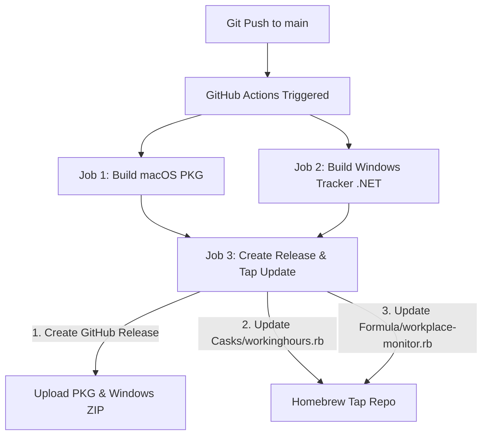

# CI/CD Pipeline Changes for Windows & Homebrew Formula Support

This document outlines the pipeline updates required to compile the C# Windows Tracking Agent, upload the compiled artifacts as release assets, and automatically push a Homebrew Formula update to the developer Tap repository (`govind0229/homebrew-tap`).

---

## 1. Overview of Pipeline Flow

Whenever a change is pushed to the `main` branch:



---

## 2. Specific Pipeline Job Additions (`.github/workflows/build-release.yml`)

We must update the `.github/workflows/build-release.yml` workflow file to incorporate these improvements.

### 2.1 Add Windows Build Job
We will add a new `build-windows` job targeting a Windows runner to compile `win_utility`:
```yaml
  build-windows:
    runs-on: windows-latest
    steps:
      - name: Checkout Code
        uses: actions/checkout@v4

      - name: Setup .NET
        uses: actions/setup-dotnet@v4
        with:
          dotnet-version: '8.0.x'

      - name: Restore and Build C# Tracker
        run: |
          dotnet publish win_utility/win_utility.csproj -c Release -r win-x64 --self-contained true -p:PublishSingleFile=true -o ./publish

      - name: Create Release Zip
        run: |
          powershell -Command "Compress-Archive -Path ./publish/* -DestinationPath ./workplace-monitor-win.zip"

      - name: Upload Windows Artifact
        uses: actions/upload-artifact@v4
        with:
          name: WorkplaceMonitor-win
          path: workplace-monitor-win.zip
```

### 2.2 Update Release & Homebrew Tap Job
We will update the `release` job to:
1. Download the Windows ZIP artifact alongside the macOS PKG files.
2. Build a clean source tarball (`workplace-monitor-v{version}.tar.gz`) for the Homebrew CLI installation.
3. Compute the SHA256 checksum of the source tarball.
4. Auto-generate the Homebrew Formula under `Formula/workplace-monitor.rb` inside the Tap repository.
5. Push the compiled files to GitHub Releases.

```bash
# 1. Create clean source tarball
tar -czf workplace-monitor-v${VERSION}.tar.gz --exclude='.git' --exclude='node_modules' .
SHA_SOURCE=$(sha256sum workplace-monitor-v${VERSION}.tar.gz | awk '{print $1}')

# 2. Write Formula to tap-repo
mkdir -p Formula
cat > "Formula/workplace-monitor.rb" << EOF
class WorkplaceMonitor < Formula
  desc "Workplace activity tracker and status sync monitor"
  homepage "https://github.com/govind0229/Workplace-monitor"
  url "https://github.com/govind0229/Workplace-monitor/releases/download/v#{version}/workplace-monitor-v#{version}.tar.gz"
  sha256 "${SHA_SOURCE}"
  license "MIT"

  depends_on "node"

  def install
    libexec.install Dir["*"]
    (bin/"workplace-monitor").write <<~EOS
      #!/bin/bash
      exec "#{Formula["node"].opt_bin}/node" "#{libexec}/server.js" "$@"
    EOS
  end

  service do
    run [opt_bin/"workplace-monitor"]
    keep_alive true
    log_path var/"log/workplace-monitor.log"
    error_log_path var/"log/workplace-monitor.log"
  end
end
EOF
```

---

## 3. Required Secrets and Configurations

1. **`TAP_GITHUB_TOKEN`**:
   - A Personal Access Token (PAT) with `repo` permissions to allow the workflow to commit and push formula updates directly to `github.com/govind0229/homebrew-tap`.
2. **`GITHUB_TOKEN`**:
   - The default scoped token, used to publish binary ZIP and PKG files directly onto the GitHub Release drafts.
