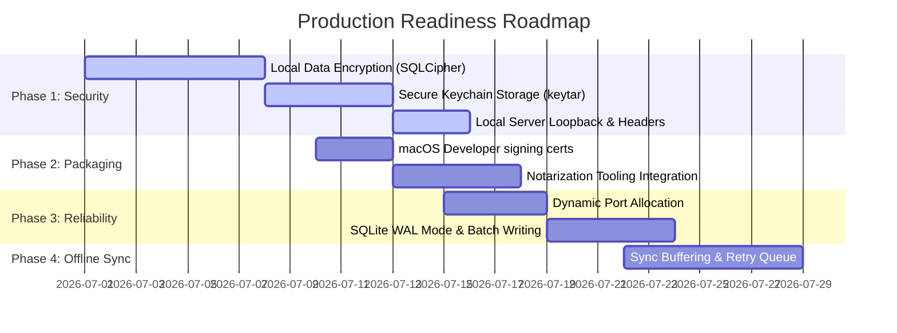

# Workplace Monitor: Production-Ready Roadmap & Plan

This document outlines the technical requirements, architectural enhancements, security standards, and deployment pipelines required to take the Workplace Monitor from a local development tool to a production-grade, secure, and distributable macOS desktop application.

---

## Phase 1: Security & Data Privacy (Critical)

Since Workplace Monitor tracks active application names, browser URLs, geofences, and syncs credentials, safeguarding user privacy and data integrity is paramount.

### 1.1 Local Data Encryption (SQLCipher)
* **Current**: Plaintext SQLite database (`working_hours.db`) stored in Application Support.
* **Production**: 
  - Integrate **SQLCipher** (via `better-sqlite3-multiple-ciphers` or native bindings) to encrypt the database file on disk using AES-256.
  - Generate a secure encryption key dynamically per installation.

### 1.2 Secure Credential Storage (macOS Keychain)
* **Current**: Slack Tokens and Teams Webhooks are stored in plaintext in the SQLite `settings` table.
* **Production**:
  - Remove all secrets from the SQLite database.
  - Store Slack Tokens, API Keys, and Webhook URLs securely in the **macOS Keychain Services** using a Node.js native binding library (like `keytar`) or a custom Swift bridge helper.

### 1.3 Local Server Hardening (TLS & Security Headers)
* **Current**: HTTP local server on port 3000.
* **Production**:
  - Use **Helmet.js** to inject essential HTTP security headers (Content Security Policy, X-Frame-Options, HSTS).
  - Enforce local loopback restriction (binding the server strictly to `127.0.0.1` and rejecting external network requests to prevent unauthorized access from other devices on the same LAN).
  - Support self-signed local TLS certificates or HTTP Basic Auth if local network access is needed.

---

## Phase 2: macOS Distribution & Packaging (Gatekeeper Compliance)

For users to install the application without macOS security warnings ("App is damaged", "Unidentified Developer"), the app must comply with Apple's strict distribution policies.

### 2.1 Code Signing & Notarization
* **Requirement**: Complete Apple Developer Account membership.
* **Notarization Pipeline**:
  - Sign the compiled Swift binary (`mac_utility`) and the Node.js executable using a **Developer ID Application** certificate.
  - Bundle them inside a `.dmg` or `.pkg` installer and sign it using a **Developer ID Installer** certificate.
  - Submit the signed bundle to Apple's **Notarization Service** (`xcrun notarytool`) during the build process to clear Apple Gatekeeper checks.

### 2.2 Multi-Architecture Support (Universal Binary)
* **Current**: Individual architectures (`x64` / `arm64`).
* **Production**:
  - Compile the Swift tracking module as a universal binary (`lipo -create mac_utility_x86_64 mac_utility_arm64 -output mac_utility`).
  - Package the app using a universal Node.js binary or distribute separate signed installers for Intel and Apple Silicon (M1/M2/M3) chips.

---

## Phase 3: Application Architecture & Reliability

Enhance the stability of background monitoring, port allocation, and error recovery.

### 3.1 Dynamic Port Allocation
* **Current**: Hardcoded port `3000`. If port 3000 is occupied, the server crashes.
* **Production**:
  - Implement a dynamic port finder on startup (e.g. scanning starting at `3000` until an open port is found).
  - Write the allocated port dynamically to a local configuration file (e.g., `~/.workplace_monitor_port`) so that the background Swift menu bar launcher and menu bar helper can connect to the correct endpoint.

### 3.2 Robust Migration Framework
* **Current**: Database schema updates are written using raw `try/catch ALTER TABLE` blocks in `db.js`.
* **Production**:
  - Implement a migration framework (e.g., using `umzug` or a lightweight custom SQL migration runner).
  - Track applied migrations in a `schema_migrations` table to ensure safe, transactional database upgrades.

### 3.3 SQLite Optimization (WAL Mode & Transaction Pooling)
* **Current**: Single database handles both read reports and rapid writes (e.g., logging foreground app name ticks).
* **Production**:
  - Enable **Write-Ahead Logging (WAL)** mode (`PRAGMA journal_mode=WAL`) to allow concurrent reads and writes without database lock contention.
  - Batch frequent database writes (e.g. flushing app usage metrics to disk every 10–30 seconds in a single transaction, instead of doing individual writes every second).

---

## Phase 4: Offline Synchronization & Reliability

Provide robust handling of remote synchronization when the user goes offline or has a spotty network.

### 4.1 Sync Buffer Queue
* **Current**: Cloud sync syncs directly, failing if the target server is unreachable.
* **Production**:
  - Implement an offline-first transactional queue (`sync_queue`).
  - When the user is offline, save sync logs locally.
  - Periodically poll connection status; when internet connectivity is restored, sync buffered logs to the cloud API in batches using an exponential backoff retry mechanism.

---

## Phase 5: Production Monitoring & Support

### 5.1 Integrated Crash Reporting
* **System**: Integrate **Sentry** (or Firebase Crashlytics) in both:
  - The frontend JavaScript bundle.
  - The background Node.js server.
  - The compiled Swift tracking executable.
* **Purpose**: Capture unhandled exceptions, memory warnings, or local crashes and upload diagnostic stack traces automatically.

### 5.2 Graceful Shutdown Handlers
* **Logic**: Intercept termination signals (`SIGTERM`, `SIGINT`).
* **Actions**: Close all SQLite database connections cleanly, serialize cached memory states to disk, release system tracking observers in Swift, and close network sockets.

---

## Recommended Phase-wise Execution Timeline

