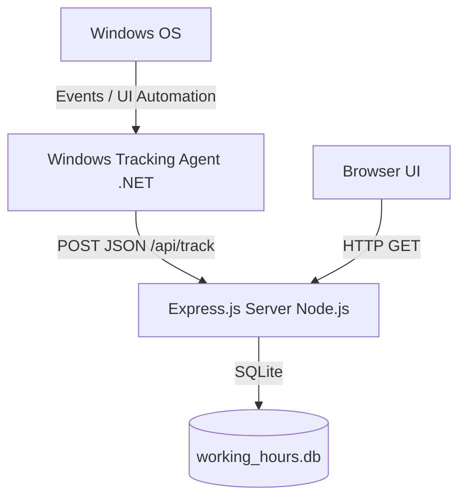

# Windows Support Implementation Plan

This document outlines the technical plan to add Windows support for the Workplace Monitor, enabling native background tracking, automatic startup, and command-line installation using Scoop/Winget (Windows equivalents of macOS Homebrew).

---

## 1. System Architecture on Windows

On Windows, the application will follow a similar decoupled architecture to the macOS version:



1. **Frontend & Backend (Cross-Platform)**: 
   - The Express.js server and Web UI will run natively on Windows via Node.js (identical code).
2. **Windows Tracking Agent (Native C# .NET)**:
   - A lightweight, headless C# executable (`win_utility.exe`) running in the background.
   - Communicates with the local server at `http://127.0.0.1:3000/api/track`.

---

## 2. Native Windows Tracking Implementation (C# .NET)

Instead of Swift, we will implement the tracking agent in **C# (.NET Core)** compileable to a tiny, self-contained single file with zero external dependencies.

### 2.1 Active App & Window Title Tracking
We will use native Win32 APIs via P/Invoke:
- `GetForegroundWindow()`: Retrieves a handle to the active foreground window.
- `GetWindowThreadProcessId()`: Gets the Process ID of the active window.
- `Process.GetProcessById(pid).MainModule.ModuleName`: Resolves the executable name (e.g., `chrome.exe`, `devenv.exe`).

### 2.2 Active Browser URL Extraction
Unlike macOS which uses AppleScript, Windows uses **UI Automation** (`System.Windows.Automation`) to extract URLs from major browsers (Chrome, Edge, Firefox):
- Locate the browser window.
- Traverse the accessibility control tree to find the edit control containing the address bar value (e.g., matching control type `Edit` or `ControlType.Edit`).

### 2.3 Screen Lock / Unlock Detection
Listen to Windows Session events using `.NET`'s Microsoft.Win32 namespace:
```csharp
SystemEvents.SessionSwitch += (sender, e) => {
    if (e.Reason == SessionSwitchReason.SessionLock) {
        // Send 'away' status due to screen lock
    } else if (e.Reason == SessionSwitchReason.SessionUnlock) {
        // Resume 'active' status
    }
};
```

---

## 3. Package Management & Installation (Scoop & Brew)

### 3.1 Windows Command-line Installation (Scoop)
Homebrew is built specifically for macOS and Linux (WSL). For native Windows command-line installation, **Scoop** is the industry standard developer-focused equivalent.

We will create a Scoop manifest (`workplace-monitor.json`) so users can install it natively:
```json
{
  "version": "1.0.0",
  "description": "Workplace activity tracker and status sync monitor.",
  "homepage": "https://github.com/user/workplace-monitor",
  "license": "MIT",
  "url": "https://github.com/user/workplace-monitor/releases/download/v1.0.0/workplace-monitor-win.zip",
  "bin": "win_utility.exe",
  "shortcuts": [
    ["win_utility.exe", "Workplace Monitor Launcher"]
  ],
  "persist": "data"
}
```
**Installation command**:
```powershell
# Add custom bucket and install
scoop bucket add workplace-monitor https://github.com/user/workplace-monitor-bucket
scoop install workplace-monitor
```

### 3.2 Linux & WSL Support (Homebrew Formula)
For Windows users running within WSL (Windows Subsystem for Linux), we will distribute a Homebrew formula (`workplace-monitor.rb`) to run the Express backend server:
```ruby
class WorkplaceMonitor < Formula
  desc "Workplace activity tracker and status sync monitor"
  homepage "https://github.com/user/workplace-monitor"
  url "https://github.com/user/workplace-monitor/archive/refs/tags/v1.0.0.tar.gz"
  sha256 "..."
  license "MIT"

  depends_on "node"

  def install
    libexec.install Dir["*"]
    bin.write_exec_script libexec/"server.js"
  end

  service do
    run [opt_bin/"workplace-monitor"]
    keep_alive true
    log_path var/"log/workplace-monitor.log"
    error_log_path var/"log/workplace-monitor.log"
  end
end
```

---

## 4. Development Git Workflow

1. **Current State**: 
   - Git commit successfully made on `main` summarizing all status sync and UI tweaks.
   - Checked out a clean branch `feature/windows-support`.
2. **Next Steps**:
   - Set up the `.NET` project structure under `src/windows-tracker/`.
   - Write the C# tracking agent implementation.
   - Build and test URL resolution for Edge, Chrome, and Firefox on Windows.
